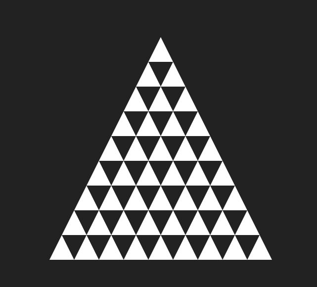

# Pyramide de KhAECops

## Explications et objectif
Le but de cet exercice est de créer une pyramide formée de triangles. Vous devrez écrire le code qui place chacun des petits triangles afin que ça forme la pyramide complète.

## `dessiner_pyramide(largeur_base)`
Cette fonction constitue votre point de départ. C'est dans cette fonction que vous devrez faire plusieurs appels à la fonction `triangle()` afin de dessiner la pyramide.
- `largeur_base`
    - Nombre de triangles composant la base de la pyramide

## `triangle(x, y, largeur [,couleur])`
Dessine un triangle équilatéral (tous les cotés ont la même dimension) à la position `x, y` d'une largeur `largeur`. Une paramètre optionel permet de choisir la couleur.
- `x`
    - Position horizontale **du centre** du triangle
- `y`
    - Position verticale **du centre** du triangle
- `largeur`
    -  Largeur du triangle
- `couleur`
    - optionel
    - Même formats que `ctx.fillStyle`
        - `"#000000"`
        - `"rgb(255,0,0)"`
        - `"red"`

